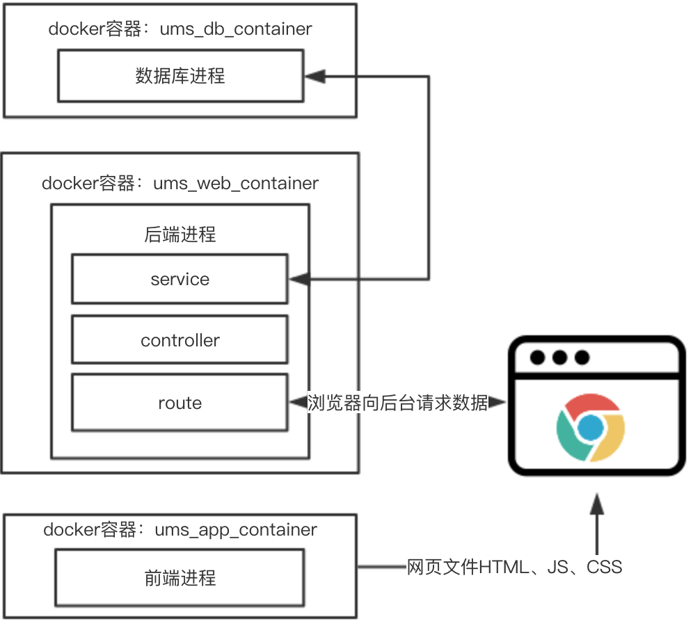

## 运行步骤
首次运行时需按步骤执行，而之后需要重启服务时只需执行第4步即可
1. 在运行之前先要安装好docker，具体如何安装可见如下链接：
[Docker安装](https://store.docker.com/search?type=edition&offering=community)
2. 在docker客户端中配置文件共享  
3. 配置dockerStore的国内镜像（可以先跳过这一步，如果镜像下载太慢再回头做也可）
4. 运行docker容器（在第一次配置完成后运行以下代码即可重新启动容器）  

```
#运行三个容器
#在项目根目录运行
docker-compose up

# 运行后端
# 打开一个新的terminal
docker exec -it ums_web_container /bin/bash
cd /usr/src/app
npm cache clean --force
npm i
npm start

# 运行前端
# 打开一个新的terminal
docker exec -it ums_app_container /bin/bash
cd /usr/src/app
npm cache clean --force
npm i
npm run dev
```

5. 导入数据库数据

```
docker exec -it ums_db_container /bin/bash
cd /data
mongorestore -d ums ./export/ums
```
## 程序结构
项目分为三个部分，由前端容器（ums_app_container）、后端容器（ums_web_container）和数据库容器（ums_db_container）组成。
1. 前端容器（ums_app_container）  
前端容器中包含一个Webpack进程，负责向请求的浏览器返回网页文件即位于```/build```目录下的内容，其中bundle.js为打包过后的js以及css。  
前端应用是在React框架下来进行编写的，其中```/app/routes```目录下为所有页面组件，由于时间仓促，没有对页面进行组件拆分，每个界面都是由一个单独的组件来定义的。前端的数据管理是由Redux来进行的，所有的reducer都定义在```/app/reducers```中。在开发时可以使用[Redux-devtools](https://github.com/zalmoxisus/redux-devtools-extension)来监视前端的数据变化。

2. 后端容器（ums_web_container）
由于本项目采取前后端分离的架构，所以前端的数据以及进行的操作是在后期通过向后端进程发送Ajax请求来进行的。后端进程则提供RESTful API来供前端应用调用。后端进程总共分为三层，路由（route）、控制器（controller）和服务（service），路由位于```/server/routes```，控制器位于```/server/controllers```，服务位于```/server/services```。后端进程接收到一个请求后先由路由进行判断，并将请求交由对应控制器来进行处理，控制器则使用对应服务来对数据库进行存取并返回HTTP请求。这边需要注意的是控制器只与请求有关，不涉及数据库代码；服务则只与数据库有关，不涉及请求相关代码，这样可以使得任意一部分有变化时不会影响到全部后端代码。
3. 数据库容器（ums_db_container）  
数据库容器直接由官方mongodb镜像生成，考虑到Docker for Windows数据卷与mongodb镜象不兼容，数据并没有以数据卷的形式存储至本机。首次使用时需要将```/data/export```中的数据还原至数据库中。每次数据库有变化时使用命令```mongodump -d ums -o ./export```来将数据库导出至```/data/export```中一并同步至git仓库中，数据库数据导入如上第五步。数据库可使用[Robo 3T](https://robomongo.org/download)来进行调试。


